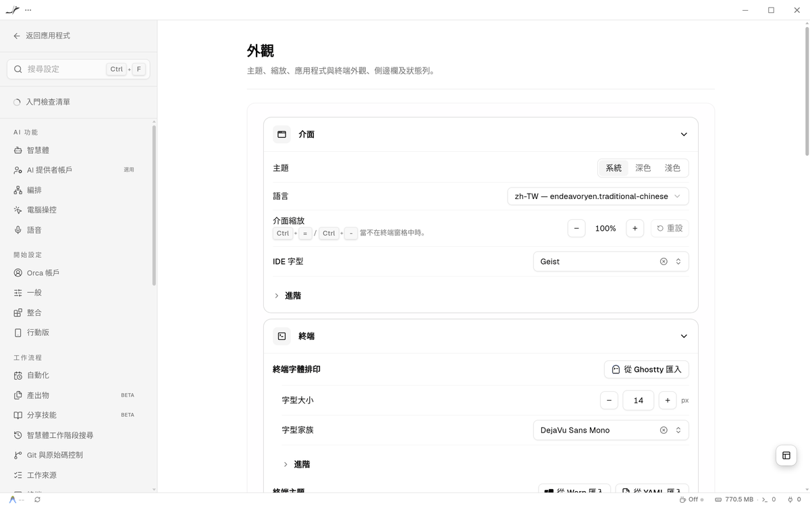

# orca-traditional-chinese

<!-- orca-badge:start -->

<!-- orca-badge:end -->

[Orca](https://github.com/stablyai/orca) 的繁體中文（台灣）語言包，涵蓋設定、側邊欄、編輯器、終端機與選單等介面。每天由 CI 比對上游，自動跟上 Orca 的每個 **stable** 版本。

Orca v1.4.222「設定 → 外觀」頁面。英文原版對照：[appearance-en.png](docs/images/appearance-en.png)

## 安裝

1. **新增來源**：前往 **Settings → Plugins**，開啟 **Plugin system**（預設關閉且標記為實驗性），點選 **Manage sources**，輸入 Git URL `https://github.com/EndeavorYen/orca-traditional-chinese.git`、Git ref `main`，再按 **Add source**。
2. **安裝並啟用**：在 **Traditional Chinese** 卡片按 **Install** → **Install plugin**，再按 **Enable plugin**。
3. **套用語言**：前往 **Settings → Appearance → Language**，選取 `zh-TW — endeavoryen.traditional-chinese`。

> **遷移提示**：先前使用 `a-lang.traditional-chinese` 的使用者，因發布者身分已變更為 `endeavoryen`，請先移除舊的來源與外掛，再依上述步驟安裝。

## 現況

<!-- sync-status:start -->
- **15,057 / 15,057** translatable strings translated (100%)
- Synced against `stablyai/orca` `v1.4.222` (`4bb6f20`, 2026-10-06)
- 180 plugin-protected keys and 2 oversize inline-CSS keys are excluded by design and fall back to English
<!-- sync-status:end -->

`engines.orca` (`>=1.4.0`) is the minimum engine that can load this pack, not the badge's tested release.
每次對齊 Orca release 時 plugin 版本只 bump patch；minor 與 major 僅在身分或引擎需求變更時調整。

## 已知限制

- 外掛保護鍵值（`auto.components.settings.plugin*`）與超過 8,192 字元的超長字串依設計維持英文。
- 語言選單目前顯示為 `zh-TW — endeavoryen.traditional-chinese`，待上游支援自訂 `displayName`（[#13031](https://github.com/stablyai/orca/issues/13031)、[#13140](https://github.com/stablyai/orca/pull/13140)）。
- 譯文採 LLM 輔助生成，並經 loader、placeholder 與術語表自動檢查，歡迎協助修正。

## 貢獻

歡迎針對 `locales/zh-TW.json` 提交 PR。用詞請依 `scripts/glossary.json`，佔位符（如 `{{value0}}`、`{host}`、`<tag>`）及品牌／CLI 指令保持原文。
送出前請先在本機執行 `python3 scripts/sync.py validate` 驗證；同步流程與維護說明見 [docs/MAINTAINING.md](docs/MAINTAINING.md)。

## 致謝與上游

- [stablyai/orca](https://github.com/stablyai/orca)：本語言包翻譯的應用程式。Orca 及其英文字串的權利屬於原作者。
- 本專案 fork 自 [@a-lang](https://github.com/a-lang) 建立的 [a-lang/orca-traditional-chinese](https://github.com/a-lang/orca-traditional-chinese)，感謝原作者打下的基礎。本 fork 改以發布者 `endeavoryen` 持續維護，因此舊版使用者需依上方遷移提示重新安裝。
